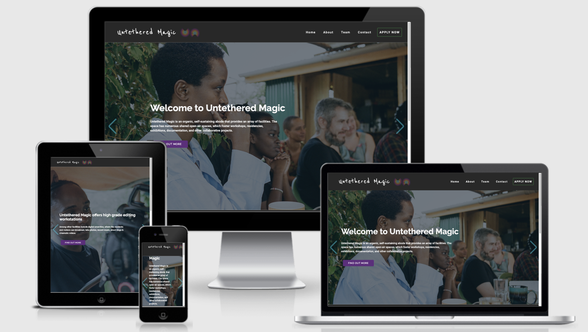

<h1 align="center">Untethered Magic Website</h1>

[View the live project here.](https://ciaran-nash.github.io/user-centric-frontend-development-milestone-project/)

This is the main website for the Untethered Magic Residency Programme. It is designed to be responsive and accessible on a range of devices, making it easy to navigate for potential applicant artists, funders and partners.

<h2 align="center"></h2>

## User Experience (UX)

-   ### User stories

    -   #### First Time Visitor Goals

        1. As a First Time Visitor, I want to easily understand the main purpose of the site and learn more about the organisation.
        2. As a First Time Visitor, I want to be able to easily navigate throughout the site to find content.
        3. As a First Time Visitor, I want to look for testimonials to understand what their users think of them and see if they are trusted. I also want to locate their social media links to see their followings on social media to determine how trusted and known they are.

    -   #### Returning Visitor Goals

        1. As a Returning Visitor, I want to find information about upcoming opportunities such as residencies to apply for.
        2. As a Returning Visitor, I want to find the best way to get in contact with the organisation with any questions I may have.
        3. As a Returning Visitor, I want to find community links.

    -   #### Frequent User Goals
        1. As a Frequent User, I want to check to see if there are any newly added opportunities, news or documentation of previous events.
        2. As a Frequent User, I want to check to see if there are any new blog posts.
        3. As a Frequent User, I want to sign up to the Newsletter so that I am emailed any major updates and/or changes to the website or organisation.

-   ### Design
    -   #### Colour Scheme
        -   The three main colours used are Untethered Magic neon pink, purple, and very dark chocolate.
    -   #### Typography
        -   Various heavier weights of Raleway font are used throughout the whole website for headings with Sans Serif as the fallback font in case for any reason the font isn't being imported into the site correctly. Designed by Vernon Adams, Oswald is used freely across the internet by web browsers on desktop computers, laptops and mobile devices.
        -   Roboto font is the main body font used throughout the whole website with Sans Serif as the fallback font in case for any reason the font isn't being imported into the site correctly. Roboto is a clean font that has become increasingly popular on the web, so it is both attractive and appropriate.
        -   The cursive font Reenie Beanie is used for the navbrand logotype with Cursive and then Sans Serif as the fallback fonts in case for any reason the font isn't being imported into the site correctly. As the site is updated, an SVG file will be placed for the navbar brand that will incoporporate both the logo and the logotype.
    -   #### Imagery
        -   Imagery is important. The large, background hero image is designed to be striking and catch the user's attention. It also has a modern, energetic aesthetic.

*   ### Wireframes

    -   Home Page Desktop Wireframe - [View](assets/images/wireframes/homepage-desktop.png)

    -   Home Page Tablet Wireframe - [View](assets/images/wireframes/homepage-tablet.png)

    -   Home Page Mobile Wireframe - [View](assets/images/wireframes/homepage-mobile.png)

    -   About Page Desktop Wireframe - [View](assets/images/wireframes/about-desktop.png)

    -   About Page Tablet Wireframe - [View](assets/images/wireframes/about-tablet.png)

    -   About Page Mobile Wireframe - [View](assets/images/wireframes/about-mobile.png)

    -   Contact Page Desktop Wireframe - [View](assets/images/wireframes/contact-desktop.png)

    -   Contact Page Tablet Wireframe - [View](ssets/images/wireframes/contact-tablet.png)

    -   Contact Page Mobile Wireframe - [View](assets/images/wireframes/contact-mobile.png)

## Features Included

-   Responsive on all device sizes

-   Interactive elements (be more specific)

-   Showcase photos and information from previous residencies and events including participating artists and workshops in action.

-   Publicise the collectives upcoming residency programmes and events.

-   Provide details on the space's location, opening hours, and information on how to travel there.

-   Provide links to external resources, such as the collective's social media profiles and the social media profiles of the individuals comprising the collective.

-   Provide links to external resources, such as the collective's supporting institutions online presence and social media profiles. 

-   Provide link to download the collective's portfolio and catalogue as a PDF.

## Potential Future Features to be Included

-   Provide links to previous participants' online presence and social media profiles. 

-   Showcase downloadables and output from previous residencies and events and workshops to comprise a knowledge commons section.

-   After a longer period of time, approximately five years, archive photos and information from previous residencies and events including participating artists and workshops in action as they decrease in relevance.

-   Provide details on the space's location, opening hours, and information on how to travel there.

## Technologies Used

### Languages Used

-   [HTML5](https://en.wikipedia.org/wiki/HTML5)
-   [CSS3](https://en.wikipedia.org/wiki/Cascading_Style_Sheets)

### Frameworks, Libraries & Programs Used

1. [Bootstrap 4.4.1:](https://getbootstrap.com/docs/4.4/getting-started/introduction/)
    - Bootstrap was used to assist with the responsiveness and styling of the website.
1. [Hover.css:](https://ianlunn.github.io/Hover/)
    - Hover.css was used on the Social Media icons in the footer to add the float transition while being hovered over.
1. [Google Fonts:](https://fonts.google.com/)
    - Google fonts were used to import the 'Titillium Web' font into the style.css file which is used on all pages throughout the project.
1. [Font Awesome:](https://fontawesome.com/)
    - Font Awesome was used on all pages throughout the website to add icons for aesthetic and UX purposes.
1. [jQuery:](https://jquery.com/)
    - jQuery came with Bootstrap to make the navbar responsive but was also used for the smooth scroll function in JavaScript.
1. [Git](https://git-scm.com/)
    - Git was used for version control by utilizing the Gitpod terminal to commit to Git and Push to GitHub.
1. [GitHub:](https://github.com/)
    - GitHub is used to store the projects code after being pushed from Git.
1. [Photoshop:](https://www.adobe.com/ie/products/photoshop.html)
    - Photoshop was used to create the logo, resizing images and editing photos for the website.
1. [Adobe XD:](https://www.adobe.com/africa/products/xd.html)
    - XD was used to create the [wireframes](https://github.com/) during the design process.

## Testing

The W3C Markup Validator and W3C CSS Validator Services were used to validate every page of the project to ensure there were no syntax errors in the project.

-   [W3C Markup Validator](https://jigsaw.w3.org/css-validator/#validate_by_input) - [Results](assets/docs/milestone-one-project-css-validation-report-jigsaw-w3-org-css-validator-validator-2021-04-06-12_08_07.pdf)
-   [W3C CSS Validator](https://jigsaw.w3.org/css-validator/#validate_by_input) Index Page - [Results](assets/docs/assets/docs/milestone-project-one-index-page-validator-w3-org-nu-2021-04-06-13_35_59.pdf)
-   [W3C CSS Validator](https://jigsaw.w3.org/css-validator/#validate_by_input) About Page - [Results](assets/docs/assets/docs/assets/docs/milestone-project-one-about-page-validator-w3-org-nu-2021-04-06-13_43_29.pdf)
-   [W3C CSS Validator](https://jigsaw.w3.org/css-validator/#validate_by_input) Team Page - [Results](assets/docs/assets/docs/assets/docs/assets/docs/milestone-project-one-team-page-validator-w3-org-nu-2021-04-06-13_38_13.pdf)

### Testing User Stories from User Experience (UX) Section

-   #### First Time Visitor Goals

    1. As a First Time Visitor, I want to easily understand the main purpose of the site and learn more about the organisation.

        1. Upon entering the site, users are automatically greeted with a clean and easily readable navigation bar to go to the page of their choice. Underneath there is a Hero Image with Text and a "Learn More" Call to action button.
        2. The main points are made immediately with the hero image
        3. The user has two options, click the call to action buttons or scroll down, both of which will lead to the same place, to learn more about the organisation.

    2. As a First Time Visitor, I want to be able to easily be able to navigate throughout the site to find content.

        1. The site has been designed to be fluid and never to entrap the user. At the top of each page there is a clean navigation bar, each link describes what the page they will end up at clearly.
        2. At the bottom of the first 3 pages there is a redirection call to action to ensure the user always has somewhere to go and doesn't feel trapped as they get to the bottom of the page.
        3. On the Contact Us Page, after a form response is submitted, the page refreshes and the user is brought to the top of the page where the navigation bar is.

    3. As a First Time Visitor, I want to look for testimonials to understand what their users think of them and see if they are trusted. I also want to locate their social media links to see their following on social media to determine how trusted and known they are.
        1. Once the new visitor has read the About Us and What We Do text, they will notice the Why We are Loved So Much section.
        2. The user can also scroll to the bottom of any page on the site to locate social media links in the footer.
        3. At the bottom of the Contact Us page, the user is told underneath the form, that alternatively they can contact the organisation on social media which highlights the links to them.

-   #### Returning Visitor Goals

    1. As a Returning Visitor, I want to find the news on upcoming residencies.

        1. These are clearly shown in the banner message.
        2. They will be directed to a page with another hero image and call to action.

    2. As a Returning Visitor, I want to find the best way to get in contact with the organisation with any questions I may have.

        1. The navigation bar clearly highlights the "Contact Us" Page.
        2. Here they can fill out the form on the page or are told that alternatively they can message the organisation on social media.
        3. The footer contains links to the organisations Facebook, Twitter and Instagram page as well as the organization's email.
        4. Whichever link they click, it will be open up in a new tab to ensure the user can easily get back to the website.
        5. The email button is set up to automatically open up your email app and autofill there email address in the "To" section.

    3. As a Returning Visitor, I want to find the Facebook Group link so that I can join and interact with others in the community.
        1. The Facebook Page can be found at the footer of every page and will open a new tab for the user and more information can be found on the Facebook page.
        2. Alternatively, the user can scroll to the bottom of the Home page to find the Facebook Group redirect card and can easily join by clicking the "Join Now!" button which like any external link, will open in a new tab to ensure they can get back to the website easily.
        3. If the user is on the "Our Favourites" page they will also be greeted with a call to action button to invite the user to the Facebook group. The user is incentivized as they are told there is a weekly favourite product posted in the group.

-   #### Frequent User Goals

    1. As a Frequent User, I want to check to see if there are any newly added resiency opportunites.

        1. The user would already be comfortable with the website layout and can easily click the banner message.

    2. As a Frequent User, I want to check to see if there are any new blog posts.

        1. The user would already be comfortable with the website layout and can easily click the blog link

    3. As a Frequent User, I want to sign up to the Newsletter so that I am emailed any major updates and/or changes to the website or organisation.
        1. At the bottom of every page their is a footer which content is consistent throughout all pages.
        2. To the right hand side of the footer the user can see "Subscribe to our Newsletter" and are prompted to Enter their email address.
        3. There is a "Submit" button to the right hand side of the input field which is located close to the field and can easily be distinguished.

### Further Testing

-   The Website was tested on Google Chrome, Internet Explorer, Microsoft Edge and Safari browsers.
-   The website was viewed on a variety of devices such as Windows Desktop, Laptops including MackBook Pro and Windows Machine, Samsung Galaxy Tab, Samsung Note Phone. Due to the unavailabilty of an Apple Phone the site was testing using the Chrome Dev Tools emulator for iPhoneX and iPad Pro.
-   A large amount of testing was done to ensure that all pages were linking correctly.
-   Friends and family members were asked to review the site and documentation to point out any bugs and/or user experience issues.

### Known Bugs

-   On mobile devices the NavBar toggle control is not visible. Though a pointer cursor appears, the mobile menu is not activated on click.

-   The last card on the TEAM PAGE has to margin top to push it away from the card above when stacked vertically on mobile even though the card has a mt-4 bootstrap class applied.

-   The styles for the APPLY NOW NavBar button which is a slightly modified Bootstrap button do not display in Safari Browser.

## Deployment

### GitHub Pages

The project was deployed to GitHub Pages using the following steps...

1. Log in to GitHub and locate the [GitHub Repository](https://github.com/ciaran-nash/user-centric-frontend-development-milestone-project)
2. At the top of the Repository (not top of page), locate the "Settings" Button on the menu.
    - Alternatively Click [Here](https://raw.githubusercontent.com/) for a GIF demonstrating the process starting from Step 2.
3. Scroll down the Settings page until you locate the "GitHub Pages" Section.
4. Under "Source", click the dropdown called "None" and select "Master Branch".
5. The page will automatically refresh.
6. Scroll back down through the page to locate the now published site [link](https://ciaran-nash.github.io/user-centric-frontend-development-milestone-project/) in the "GitHub Pages" section.

### Forking the GitHub Repository

By forking the GitHub Repository we make a copy of the original repository on our GitHub account to view and/or make changes without affecting the original repository by using the following steps...

1. Log in to GitHub and locate the [GitHub Repository](https://ciaran-nash.github.io/user-centric-frontend-development-milestone-project/)
2. At the top of the Repository (not top of page) just above the "Settings" Button on the menu, locate the "Fork" Button.
3. You should now have a copy of the original repository in your GitHub account.

### Making a Local Clone

1. Log in to GitHub and locate the [GitHub Repository](https://ciaran-nash.github.io/user-centric-frontend-development-milestone-project/)
2. Under the repository name, click "Clone or download".
3. To clone the repository using HTTPS, under "Clone with HTTPS", copy the link.
4. Open Git Bash
5. Change the current working directory to the location where you want the cloned directory to be made.
6. Type `git clone`, and then paste the URL you copied in Step 3.

```
$ git clone https://github.com/ciaran-nash/user-centric-frontend-development-milestone-project
```

7. Press Enter. Your local clone will be created.

```
$ git clone https://github.com/ciaran-nash/user-centric-frontend-development-milestone-project
> Cloning into `CI-Clone`...
> remote: Counting objects: 10, done.
> remote: Compressing objects: 100% (8/8), done.
> remove: Total 10 (delta 1), reused 10 (delta 1)
> Unpacking objects: 100% (10/10), done.
```

Click [Here](https://help.github.com/en/github/creating-cloning-and-archiving-repositories/cloning-a-repository#cloning-a-repository-to-github-desktop) to retrieve pictures for some of the buttons and more detailed explanations of the above process.

## Credits

### Code

-   The code for the NAVBAR was taken from the components section of the offical Bootstrap documentation [here](https://getbootstrap.com/docs/4.1/components/navbar/) and modified to suit the sites needs.

-   The code for the HOME PAGE HERO SECTION carousel was taken from the components section of the offical Bootstrap documentation [here](https://getbootstrap.com/docs/4.1/components/carousel/) and heavily modified to suit the sites needs.

-   The code for the jumbotron HOME PAGE NEWSLETTER SIGN UP component was taken from the components section of the offical Bootstrap documentation [here](https://getbootstrap.com/docs/4.1/components/jumbotron/) and modified to suit the sites needs.

-   The code for the HOME PAGE NEWSLETTER SIGN UP input group component was taken from the components section of the offical Bootstrap documentation [here](https://getbootstrap.com/docs/4.1/components/input-group/)

-   The code for the FOOTER SECTION is taken from "Putting It All Together | Mini Project with Bootstrap 4 - The Footer" coded by Matthew Rudge, instructor at The Code Institute, available [here](https://bit.ly/3rKE2Sw)

-   The code for the card group on the TEAM PAGE is taken from the components section of the offical Bootstrap documentation [here](https://getbootstrap.com/docs/4.1/components/card/)

-   The code for the ABOUT PAGE HERO SECTION came from the 'A Full Width Hero Background Image With Transparent Overlay' [Medium post](https://bit.ly/3fROfKq) by Daniel Zuzevich.

-   The code for the text and image on the ABOUT PAGE INFORMATION SECTION came from 'How to Make Complete Responsive Website Using Bootstrap/HTML/CSS by Daily Tuition on [YouTube.com](https://bit.ly/3sTjrgj) and heavily adapting it to suit the sites needs.

-   The CONTACT PAGE HEADER SECTION code is taken from Bootstrap 5 Beta 3 examples found [here](file:///Users/ciarannash/Desktop/bootstrap-5.0.0-beta3-examples/heroes/index.html)

-   The CONTACT PAGE APPLICATION FORM code is taken from the components section of the offical Bootstrap documentation [here](https://getbootstrap.com/docs/4.1/components/forms/)

-   [Bootstrap4](https://getbootstrap.com/docs/4.1/getting-started/introduction/): Bootstrap Library used throughout the project mainly to make site responsive using the Bootstrap Grid System.

-   [MDN Web Docs](https://developer.mozilla.org/) : For Pattern Validation code.

### Content

-   All content was supplied by members of Untethered Magic Residency Group.

### Media

-   All images were supplied by members of Untethered Magic Residency Group or sourced from Creative Commons Licensed resources.

-   The PNG image "Transparent Ouroboros PNG, Free Ouroboros PNG Download - PNGkin - 1" was sourced from [PNGkin](https://bit.ly/3ut6Yjw) and a blue overlay colour applied using Adobe Photoshop. 

### Acknowledgements

-   My Mentor Gerard McBride for continuous helpful feedback.

-   Tutor support at Code Institute for their support.